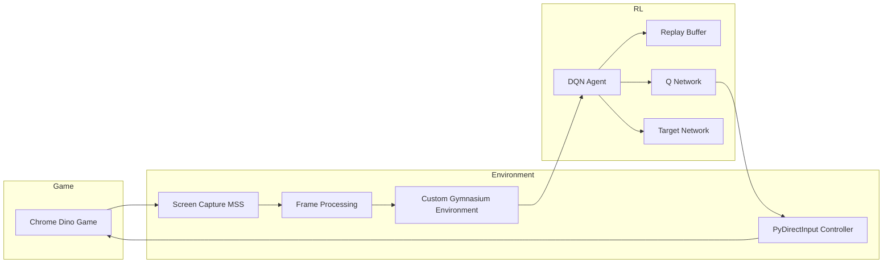
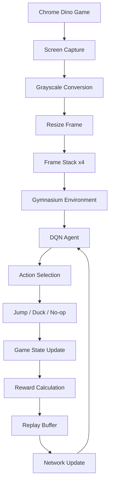
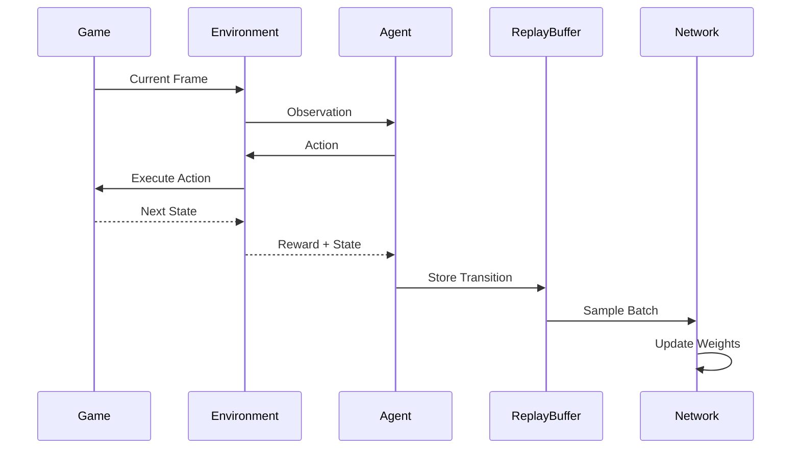

# 🦖 Chrome Dino AI – Vision-Based Reinforcement Learning Agent

A vision-based Reinforcement Learning (RL) system trained to autonomously play the Chrome Dino game using raw pixel observations, real-time screen capture, and Deep Q-Networks (DQN).

Unlike simulator-based reinforcement learning benchmarks, this project interacts directly with the live browser game through screen capture and keyboard control, creating a realistic control problem involving visual perception, action latency, and partial observability.

---

# 🚀 Overview

This project implements a custom Gymnasium-compatible environment for the Chrome Dino game and trains an autonomous agent using Stable-Baselines3's Deep Q-Network (DQN) implementation.

The system captures the game screen in real time, preprocesses visual observations, executes actions through simulated keyboard inputs, and learns obstacle avoidance policies directly from pixel data.

The project was developed under CPU-only constraints and focuses on:

* Vision-based Reinforcement Learning
* Real-time environment interaction
* Reward shaping and training stability
* Deep Q-Network optimization
* Policy evaluation and failure analysis
* Custom Gymnasium environment design

---

# 🎯 Objectives

The primary goals of this project are:

* Learn obstacle avoidance directly from visual observations
* Build a Gymnasium-compatible environment around a real-world game
* Train an RL agent without access to a simulator API
* Analyze DQN behavior in partially observable environments
* Evaluate policy stability under real-time input latency

---

# 🧠 Methodology

## Environment Design

The Chrome Dino game is wrapped inside a custom Gymnasium environment.

The environment is responsible for:

* Capturing screen frames
* Processing observations
* Executing actions
* Detecting episode termination
* Computing rewards

The agent interacts exclusively through visual information and keyboard commands.

---

## Observation Pipeline

Each observation undergoes:

1. Screen Capture (MSS)
2. Grayscale Conversion
3. Image Resizing
4. Frame Stacking (4 Frames)

Resulting observation space:

```python
Box(
    low=0,
    high=255,
    shape=(4, H, W),
    dtype=np.uint8
)
```

Frame stacking provides temporal information that helps the agent infer motion and obstacle speed.

---

## Action Space

The environment uses a discrete action space:

| Action | Description |
| ------ | ----------- |
| 0      | Jump        |
| 1      | Duck        |
| 2      | No-op       |

Actions are executed through PyDirectInput.

---

## Reward Function

The reward structure is intentionally simple:

```text
+1   for every timestep survived
-15  upon game termination
```

This encourages survival while strongly penalizing collisions.

---

# 🤖 Reinforcement Learning Algorithm

## Deep Q-Network (DQN)

The agent is trained using Stable-Baselines3's DQN implementation.

Enhancements include:

* Double DQN (SB3 default)
* Experience Replay
* Target Network Updates
* Frame Stacking
* Epsilon-Greedy Exploration

---

## Hyperparameters

| Parameter               | Value      |
| ----------------------- | ---------- |
| Learning Rate           | 7e-5       |
| Replay Buffer Size      | 60,000     |
| Batch Size              | 32         |
| Gamma                   | 0.99       |
| Exploration Fraction    | 0.7        |
| Final Epsilon           | 0.08       |
| Target Update Frequency | 1000 Steps |

---

# 🏗️ System Architecture



---

# 🔄 Training Pipeline



---

# ⚡ RL Agent Interaction Sequence



---

# 📊 Results

## Evaluation

Deterministic Policy Evaluation

```text
Episodes Evaluated: 10

Maximum Survival:
~140 Steps

Average Survival:
~60 Steps
```

---

## Emergent Behaviors

Two distinct behaviors emerged during evaluation:

### Stable Policy

* Consistent obstacle avoidance
* Survived approximately 140 steps
* Demonstrated learned timing patterns

### Degenerate Policy

* Early collisions
* Survived approximately 6 steps
* Evidence of policy instability

---

# 📈 Performance Analysis

The observed oscillation between stable and unstable policies highlights several well-known limitations of vanilla DQN:

### Partial Observability

The agent observes only a limited visual window.

### Input Latency

Real-time screen capture introduces action delays.

### Q-Value Overestimation

DQN can overestimate action values, causing policy collapse.

### Non-Stationary Visual Inputs

Obstacle spacing and speed create varying state distributions.

These challenges are extensively documented in reinforcement learning literature and represent realistic deployment constraints.

---

# ⚠️ Limitations

Current limitations include:

* CPU-only training
* No recurrent memory mechanism
* Limited temporal awareness
* Real-time latency overhead
* DQN instability under partial observability

---

# 🔬 Validation Strategy

The project was evaluated through:

1. Multiple deterministic evaluation episodes
2. TensorBoard training diagnostics
3. Reward trend monitoring
4. Survival-time analysis
5. Policy behavior inspection

---

# 🛠️ Tech Stack

## Core

* Python
* NumPy

## Reinforcement Learning

* Stable-Baselines3
* Gymnasium

## Computer Vision

* OpenCV
* MSS

## Automation

* PyDirectInput

## Monitoring

* TensorBoard

---

# 📂 Project Structure

```text
Chrome_Dino_RL/
│
├── DinoAI.ipynb
│
├── environment/
│   ├── dino_env.py
│   ├── screen_capture.py
│   ├── action_handler.py
│   └── reward_system.py
│
├── models/
│   └── trained_dqn.zip
│
├── logs/
│   └── tensorboard/
│
├── evaluation/
│   └── evaluate.py
│
├── requirements.txt
│
└── README.md
```

---

# 🚀 Future Work

Potential improvements include:

* Proximal Policy Optimization (PPO)
* Advantage Actor-Critic (A2C)
* Recurrent (LSTM) Policies
* Curriculum Learning
* Simulator-Based Training
* GPU Acceleration
* Distributed Experience Collection

---

# 📚 Key Takeaways

This project demonstrates:

* Applied Reinforcement Learning
* Computer Vision Integration
* Environment Engineering
* Real-Time Decision Making
* Deep Q-Network Training
* Experimental Analysis of RL Stability

The work highlights both the capabilities and limitations of Deep Reinforcement Learning when deployed in realistic environments without simulator access.

---

# 👨‍💻 Author

**Rudra Raj**

Full Stack Developer | AI & Quantitative Systems Enthusiast

---

## 🔍 Notebook

View the complete implementation and experiments:

https://nbviewer.org/github/SIMPLESOMEONE1202/Chrome_Dino_RL/blob/main/DinoAI.ipynb
